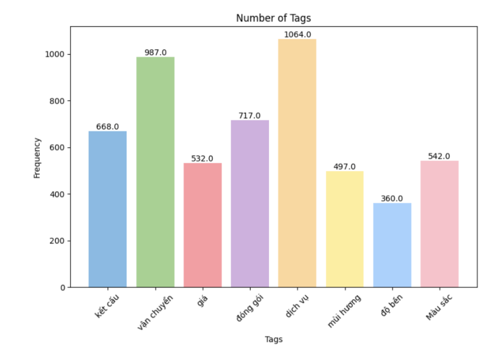
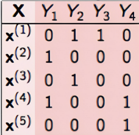
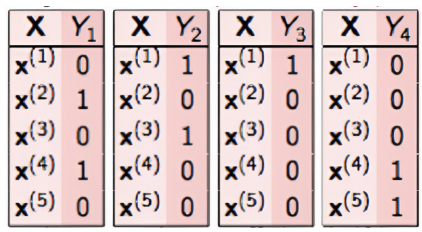
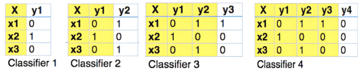
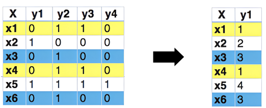

# Multilabel Classification of Customer Reviews on Tiki

This project was undertaken by my group as part of our Machine Learning course. We focused on skincare and makeup products on Tiki (E-commerce platform), aiming to classify reviews into 8 categories: delivery, packaging, color, service, smell, reliability, price, and texture.

Input: Review of customer on Tiki  
Output: Predict the labels that appear in the review

The process involved:

-   Data collection using the TIKI API
-   Labeling more than 3500 samples
-   Consensus Estimation
-   Data cleaning: removing stopwords, teencode, and correcting spelling errors
-   Data visualization
-   Data standardization: TF-IDF, Bag of Words, Word2Vec
-   Prediction of results

## Dataset

### 1. Data collection

### 2. Labeling rule

-   <b>Fragrance</b>: suitable for each individual's condition. For example: allergic skin to certain scents.
-   <b>Texture</b>: suitable for each individual's condition. For example: oily skin: use gel or serum products.
-   <b>Longevity</b>: tailored to each individual's usage needs.
    For example: long-lasting lipstick, oil control, waterproof. - <b>Color</b>: tailored to each individual's usage needs.
    For example: choose a lipstick color based on personal preference.
    Additionally, we use 3 labels to provide additional product information:
-   <b>Shipping</b>: delivery service, delivery time, delivery person.
-   <b>Price</b>
-   <b>Packaging</b>: product packaging, packaging form.
    The <b>service</b> label serves both to evaluate quality and provide information:
-   Service for quality evaluation: authenticity of the product.
-   Service for providing information: customer care, service attitude of the product seller.

### 3. Consensus Estimation

We have divided the dataset into 2 sets and proceeded to label (2 people label 1 set). Then, we use the Cohen Kappa score to compare the labeling results of the 2 people.

### 4. Data visualization

## Data Processing

### Data Preprocessing

-   Remove special characters, emoticons, and unnecessary characters in the dataset. For example: "[,./)*^]"
-   Convert all data to lowercase.
-   Remove intentionally elongated characters. For example: "sản phẩm okeeeeeeeeeeee lắmmmmm nheee" -> "sản phẩm ok lắm nhe".
-   Normalize unicode.
-   Standardize punctuation marks in the correct position, for example, "úy òa" instead of "uý oà". - Standardize teencode (some cases of abbreviated words). For teencode, we collect from the available dictionary on GitHub [], and additionally gather commonly used abbreviations in the dataset. For example: hsd: hạn sử dụng; kcn: kem chống nắng; srm: sữa rửa mặt; ckđ: che khuyết điểm, tbc: tế bào chết, ...
-   Tokenization
-   Remove excess whitespace.
-   Filter stop words based on the most frequently appearing words in the dataset.

After that, we measured the difference of the preprocessing methods to the results, and obtained a comparison table.

| Preprocessing Technique                   | Hamming Loss | Micro F1 Score |
| ----------------------------------------- | ------------ | -------------- |
| Best Possible Score                       | 0.05025      | 0.86726        |
| Remove characters, emojis, extra spaces   | 0.08398      | 0.82868        |
| Normalize Vietnamese accents              | 0.08593      | 0.82400        |
| Remove intentionally elongated characters | 0.08789      | 0.81781        |
| Normalize teencode                        | 0.07813      | 0.84127        |
| Normalize Unicode                         | 0.08203      | 0.83200        |
| Stopword removal                          | 0.09375      | 0.80487        |
| Word tokenization                         | 0.08594      | 0.82677        |

### Data standardization

Compare with 3 method: TF-IDF, Word2Vec, Bag of Word with the best score.
| Method | Hamming Loss | Micro F1 |
|-------------|--------------|-----------|
| TF-IDF | 0.05025 | 0.86726 |
| Word2Vec | 0.11999 | 0.62324 |
| Bag_of_word | 0.05042 | 0.86847 |

## Training model and Evaluation

### 1. Training method

In this report scope, we present the use of the Problem Transformation method. In this method, we will implement it in 3 different ways:

#### 1. Binary Relevance

Each label will be considered as a separate classification problem.

For example, in the case below With X as the feature and Y as the labels. the problem above will be divided into 4 separate small problems (4 labels).

#### 2. Classifier Chains

The model is initially trained on input and a label. After training, the trained label will become the input and continue training to predict the next label.

#### 3. Label Powerset

This method will consider cases with the same labels and group them into one class. As in the example below, x1 and x4 have the same label so they will be grouped into one class, similarly with x3 and x6.

#### 4. Result

We tested on SVM, NB, RF models, KNN, Logistic Regression and the results table obtained.

| Method     | Classifier | Micro F1 | Macro F1 | Micro P | Macro P | Micro R | Macro R |
| ---------- | ---------- | -------- | -------- | ------- | ------- | ------- | ------- |
| Binary     | NB         | 0.67998  | 0.62674  | 0.89258 | 0.91802 | 0.55636 | 0.51201 |
| Binary     | RF         | 0.86726  | 0.84820  | 0.94674 | 0.94678 | 0.78859 | 0.77561 |
| Binary     | KNN        | 0.21398  | 0.18181  | 0.96295 | 0.68376 | 0.12679 | 0.11036 |
| Binary     | SVC        | 0.83023  | 0.81636  | 1.0     | 0.95751 | 0.75051 | 0.73722 |
| Binary     | LR         | 0.71783  | 0.66895  | 0.99358 | 0.94588 | 0.57877 | 0.53924 |
| Classifier | NB         | 0.68988  | 0.65303  | 0.84250 | 0.85783 | 0.60230 | 0.57352 |
| Classifier | RF         | 0.85848  | 0.84678  | 0.94791 | 0.94893 | 0.78832 | 0.77955 |
| Classifier | KNN        | 0.21398  | 0.18181  | 0.96571 | 0.69981 | 0.12679 | 0.11036 |
| Classifier | SVC        | 0.82885  | 0.81462  | 0.98210 | 0.95903 | 0.74601 | 0.73217 |
| Classifier | LR         | 0.70397  | 0.65539  | 0.99499 | 0.95012 | 0.55969 | 0.52116 |
| Label      | NB         | 0.47738  | 0.35602  | 0.89964 | 0.91638 | 0.32686 | 0.26086 |
| Label      | RF         | 0.68644  | 0.62493  | 0.92877 | 0.93085 | 0.54600 | 0.50519 |
| Label      | KNN        | 0.21398  | 0.18181  | 0.94683 | 0.65222 | 0.12679 | 0.11036 |
| Label      | SVC        | 0.64809  | 0.59287  | 0.96652 | 0.96691 | 0.49823 | 0.45651 |
| Label      | LR         | 0.54890  | 0.45857  | 0.95809 | 0.95509 | 0.38814 | 0.33230 |

## Conclusion

We have built a dataset for the customer review classification problem on the e-commerce platform, consisting of over 3500 samples with 8 related labels and 2 labels being 0 and 1. We have trained the dataset and predicted customer product reviews into labels regarding quality or product information as the initial goal. We have conducted this project through steps of data collection and processing, feature extraction, model training, and evaluation. With the results obtained, the Binary Relevance method yielded the best outcome, and the Classifier Chains method had a similar result, achieving the highest performance on the Random Forest model. However, we encountered many issues in the data such as the imbalance between labels 0 and 1.

### Demo website video

[link](https://www.youtube.com/watch?v=6UNt0ybnogc)
